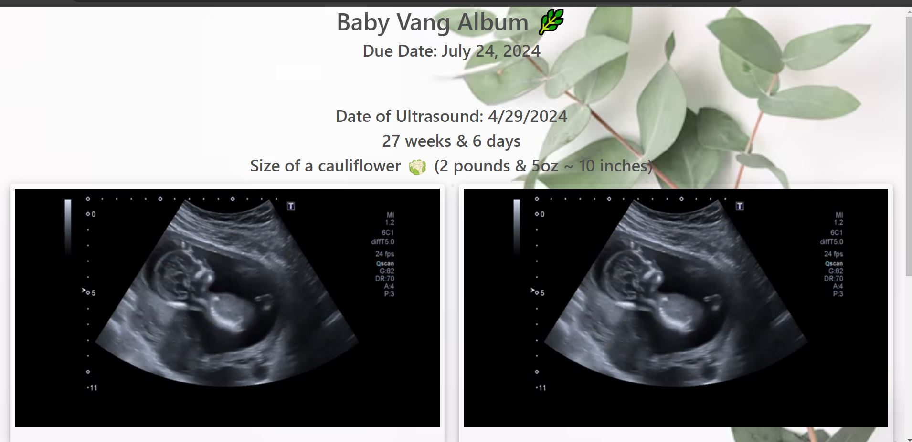
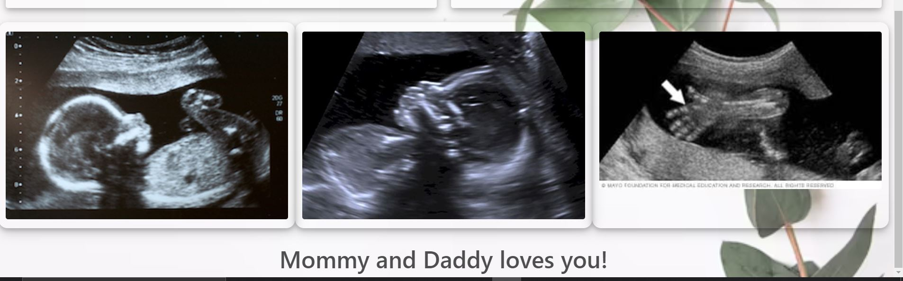

# Baby App

<div align="center">
    
</div>

<div align="center">
    
</div>

### Overview

I created this app so my wife and I can view and cherish the development journey of our daughter, from the early stages of pregnancy to the present. Please note that the videos and photos displayed are not of our actual daughter but are representative media found on the web to illustrate the developmental stages.

### Features

**Responsive Design**: Compatible with both desktop and mobile devices.
**Video Playback**: View ultrasound videos of Baby Vang directly on the page.
**Image Gallery**: Browse through baby pictures with an option to view images in fullscreen mode.
**Bootstrap Integration**: Utilizes Bootstrap 5 for a modern and responsive design.
**Full-Screen Modal**: Enhanced image viewing experience with a fullscreen modal.
**Background Imagery**: Aesthetic background image providing a soothing visual appeal.

### Technologies Used

**HTML5**: Structure and content of the web pages.
**CSS3**: Styling and layout (including Bootstrap 5 and Font Awesome for icons).
**JavaScript**: Interactivity and functionality.

### Usage:

- **Viewing Videos**:

  - Click on any video to play it. The videos will automatically loop, play, and remain muted.
  - Click on the video to enter fullscreen mode.

- **Viewing Images**:

  - Click on any image to open it in fullscreen mode.
  - Close the modal by clicking the "Close" button.

### Installation

- Clone the Repository:

  - Copy code

  ```bash
  git clone https://github.com/jvang0620/Baby_App
  ```

  - Navigate to the Project Directory:
  - Copy code
  - cd baby-vang-album
  - Open the Index File:
  - Open index.html in your preferred web browser.

### Closing:

Feel from to clone and use this app for your own personal baby app.
